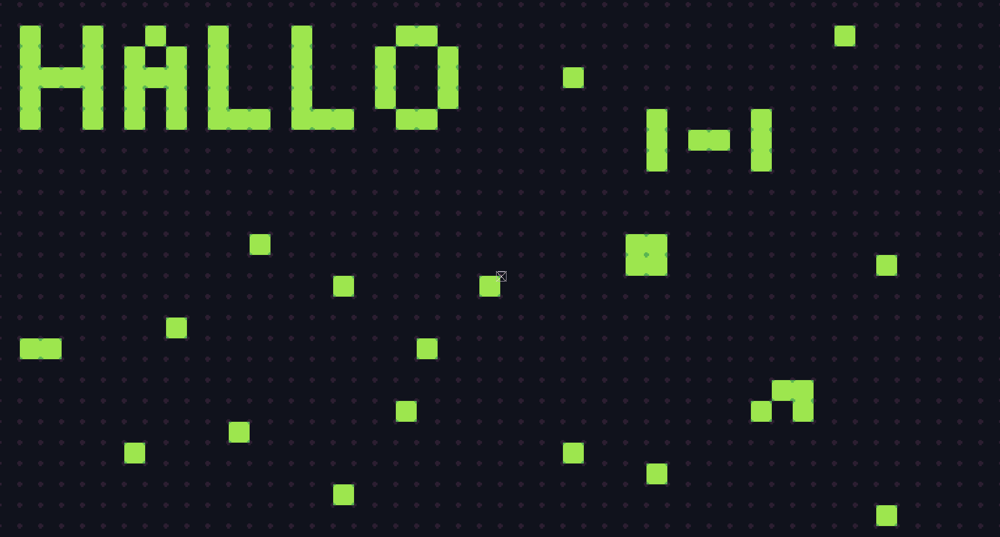
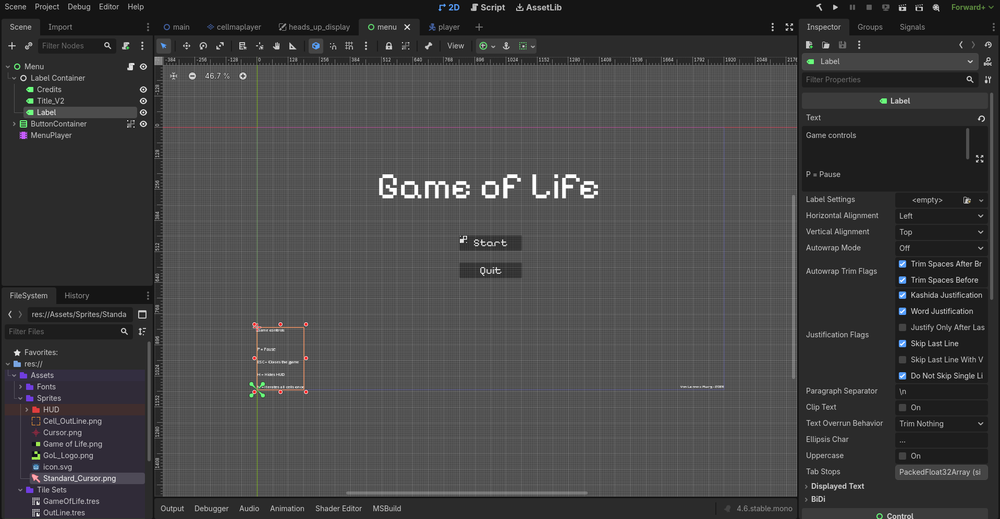

# Conways-Game-of-Life

Umsetzung von Conways Game of Life in Godot als Coding challenge

----

## 📝 Zusammenfassung

- __Was ist Conways game of Life?__

[Conways game of life](https://de.wikipedia.org/wiki/Conways_Spiel_des_Lebens) ist ein von Mathematiker __John Horton Conway__ im Jahr 1970 entworfenes Spiel welches auf einem zweidimensionalen [zellulären Automaten](https://de.wikipedia.org/wiki/Zellul%C3%A4rer_Automat) basiert.  
Mit spiel ist hiermit gemeint, ein Geschehen gemeint, welches nach festgelegten einfachen Regeln abläuft.  

- __Was ist das Ziel des Projektes?__

Das ziel ist es, Struktorierte Arbeitsabläufe, Zeitbegrenzungen und sonstige für Software Entwicklung nötige Strukturen und Arbeitsabläufe zu erlenen.

- __Warum Godot?__

Da Godot eine Engine speziell für Spiele entwicklng ist, verfüge ich mit ihr über tools mit denen ein besserer Prototyp entstehen kann.  
Ebenfalls wichtig ist das trotz das es als eine Konsolen Anwendung entwickelt werden kann, Die Godot Engine mehr möglichkeiten hat schnellere und schönere endergebnisse zu liefern.

## 🛠️ Technologien

- Godot Engine (.Net /Ehemals Mono)
- Visual Studio Code

### 🧑‍💻 Coding-/Programmier -Sprachen

- GD-script
- C#/C++ falls nötig (Für z.b. Performance, Shader, etc..)

----

## 📂 Dokumentationen

- [Todo für die Entwicklung](Docs/Todo.md)

- [Regeln des Game of Life](Docs/Rules.md)

- [Allgemeine Dokumentation](Docs/Dokumentation.md)

----

----

## Programmiersprache und sprache im code

- __Als programmiersprache wird GDscript verwendet.__
- GDscript ist eine Dynamisch geschriebene sprache,  es werden also keine semicolons oder curly brackets verwendet.  
  Es wird bei Runtime compiled und der compiler kann anhand von Tabstopps die Richtige codestruktur erkennen.

- Eine wichtige regel die ich mir bei der Entwicklung selbst gesetzt habe ist es,  
  sowohl die Variablen-Namen, als auch die Kommentare und dateien auf Englisch zu schreiben.

